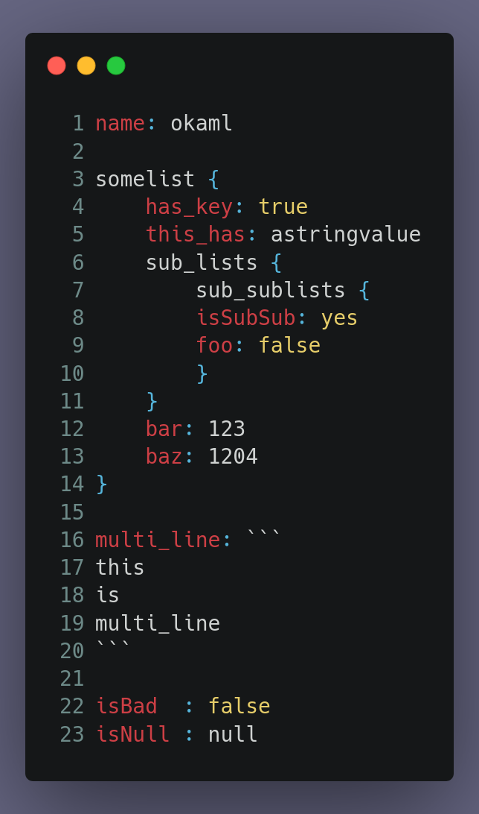

# OKAML

okaml is a language a markup language i made out of frustration of using json and yaml, I have used HUML but i feel like language with indendations is made for people who can't read through braces.  
and such is OKAML has born,  

this example is @ [syntax.okml](syntax.okml)  
This repo has a driver code to test the library  

LLM Disclaimer: LLM Generated Code was used in the project, but only for a couple helper functions -> [helpers.c](helpers.c)

ROADMAP:  
[] Parsing Multi-Line Strings  
[] Porting this multiple languages  
[] Pre-processing to make sure it's in format  
[] PR for this ngl  

